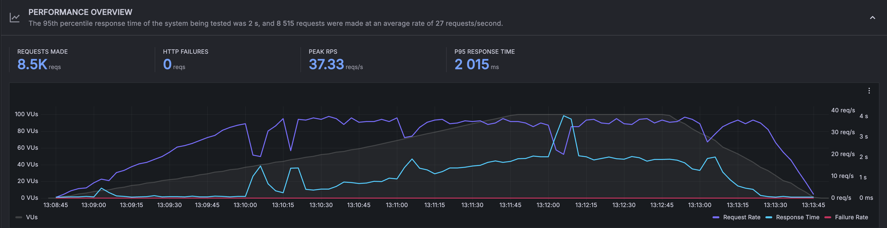
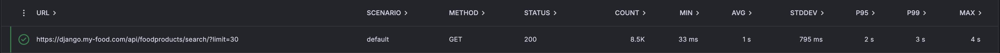
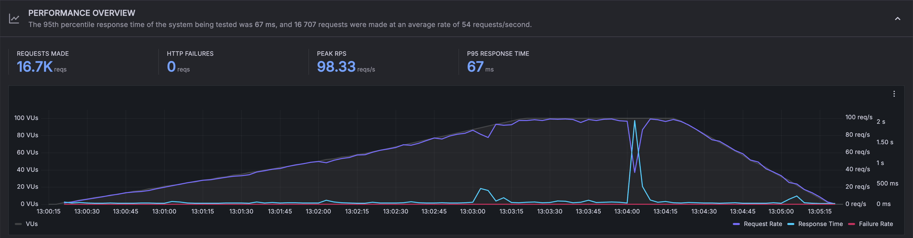
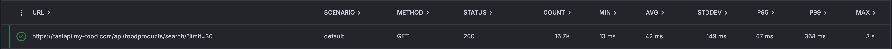
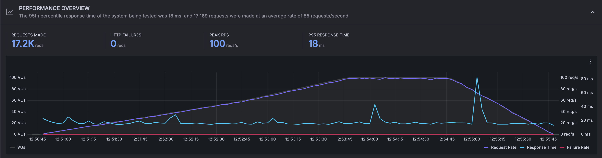
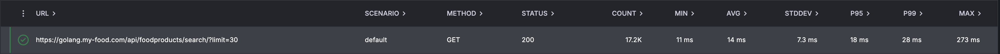

# MyFood Backend

This repository contains the backend for **MyFood**, a collection of small services built with different technologies. It includes:

- a **Django** project under `services/django`;
- a **FastAPI** project under `services/fastapi`;
- a **Golang** service using the Gin framework under `services/golang`.

All of them expose a search endpoint for food products, populated with fake data sourced from the [OpenFood Facts](https://world.openfoodfacts.org/) dataset.  
Services are deployed under my-food.com domain, you can try the endpoints:

https://django.my-food.com/api/foodproducts/search/?limit=30  
https://fastapi.my-food.com/api/foodproducts/search/?limit=30  
https://golang.my-food.com/api/foodproducts/search/?limit=30

## Load testing
The project demonstrates how services behave under load testing.

The testing includes:
- 100000 Postgres database entries
- Requests are sent with the limit of 30 items
- Requests are sent through cloud k6 load testing tool
- Django uses DRF and gunicorn, FastAPI is sync and uses uvicorn, Golang uses Gin framework
- Services are deployed on the same server, one docker container for each service
- Caddy is used as a webserver behind docker containers
- The tests are executed sequentially, not in parallel

Stages of the load are the following:
```
  stages: [
    { duration: '1m', target: 30 },
    { duration: '1m', target: 60 },
    { duration: '1m', target: 100 },
    { duration: '1m', target: 100 },
    { duration: '1m', target: 0 },
  ]
```
#### Django


#### Fastapi


#### Golang




## Features

- **Python 3.13, Django 5 + DRF, FastAPI and Golang Gin** for fast API development.
- PostgreSQL database with models for storing food products.
- Test suite using `pytest` and `factory-boy` (see `services/django/myfood/tests/`).
- Docker Compose orchestrates the server container, scheduled job images and a Caddy reverse proxy.
- Caddy acts as a reverse proxy and serves static files over HTTPS.
- GitHub Actions workflow automatically builds images and redeploys them to the production server.
- FastAPI and Golang Gin services replicate the main search endpoint.
- Database migrations are performed through the Django ORM.
- Focus on CI/CD best practices with all services deployed in Docker containers.

## Deployment

The service is deployed using a combination of Docker Compose and GitHub Actions.
`docker-compose.yaml` defines the application container, Caddy and the background command images. Caddy handles HTTPS certificates and proxies requests to the Django server while serving static files.

The workflow `.github/workflows/deploy-prod.yaml` runs on a remote runner. It builds new images, stores environment variables in a `.env` file, runs database migrations and finally restarts the stack with `docker compose up --detach django fastapi golang caddy`.

## Local Docker setup

1. Clone the repository and create a `.env` file in root folder with environment variables:
```bash
MYFOOD_DATABASE_HOST: postgres # For docker installation
MYFOOD_DATABASE_PORT: 5432
MYFOOD_DATABASE_NAME: <db_name>
MYFOOD_DATABASE_USER: <user>
MYFOOD_DATABASE_PASS: <pass>
MYFOOD_DEBUG: <True|False> # For Django service
MYFOOD_DJANGO_SECRET_KEY: <secret_key> # For Django service
```
2. Build the containers and start the stack:

```bash
docker compose up --build django fastapi golang postgres
```

3. The API will be available at:

http://localhost:8000/api/foodproducts/search/ (Django DRF)
http://localhost:8001/api/foodproducts/search/ (FastAPI)
http://localhost:8002/api/foodproducts/search/ (Golang GIN)  
http://localhost:8000/admin/ (Django admin)
